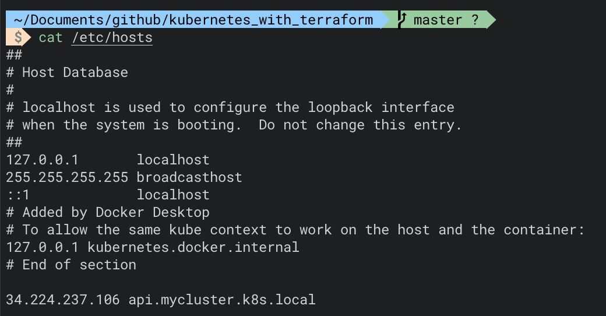
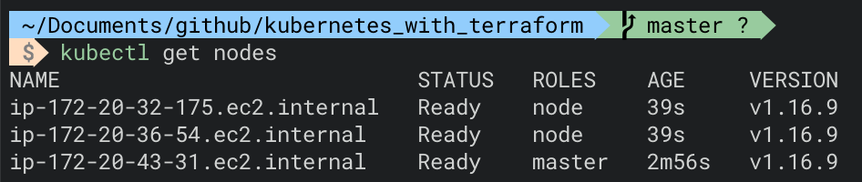
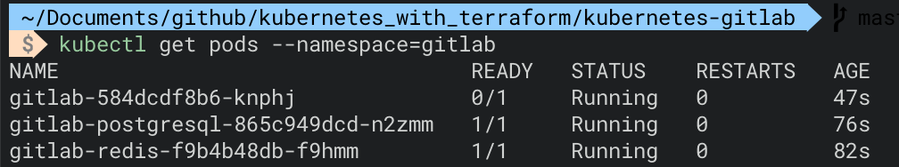
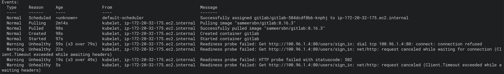

# Challenge 3 - CI pipeline with Gitlab on Kubernetes

## Provision a Kubernetes cluster on AWS

I created a Kubernetes cluster with the AWS Free Tier resources usign Kops (https://github.com/kubernetes/kops) and a gossip-based DNS.

The reasons why I've chosen Kops are mainly two:

* it can be configured to generate as output a Terraform file;
* you can use a gossip-based DNS (with the suffix k8s.local).

This way I created all the resources on AWS with Terraform, as requested, running the ```terraform apply``` command for the *cluster/kubernetes.tf* file.

I've also created a S3 resource, (named *terraform-kubernetes-fabiogallopolimi*) to store remotely the states of Terraform and Kops, applying the *global/s3/main.tf* file.

The main resources I created are:

* two Launch Configurations, one for the *master* and one for the *nodes*;
* two Auto Scaling Groups, again one for the *master* and one for the *nodes*;
* storage volumes for master and nodes;
* one Load Balancer, that listens on the port 443 (https protocol).

With *kubectl* I was able to connect to the Kubernetes cluster from my local environment, after having added in my */etc/hosts* the IP address of the Load Balancer.





## Deploy Gitlab and all required dependencies on Kubernetes

For this task I struggeled a lot, trying to understand the proper way of doing it, respecting the Free resources and the gossip-based DNS limits.

* Firstly, I tried using *Helm*, but seems like the recommended CPUs / RAM are definitely higher than the ones available in the Free Tier (From Gitlab website: A cluster with a total of 8vCPU and 30GB of RAM, or more is recommended.); in fact during the deployment my master node was taken down by the overload.

* I then tried to deploy manually Gitlab using manifests I created, but I encountered some issues with the DNS setup, and the gitlab pod was returning an error 502 when trying to start.




